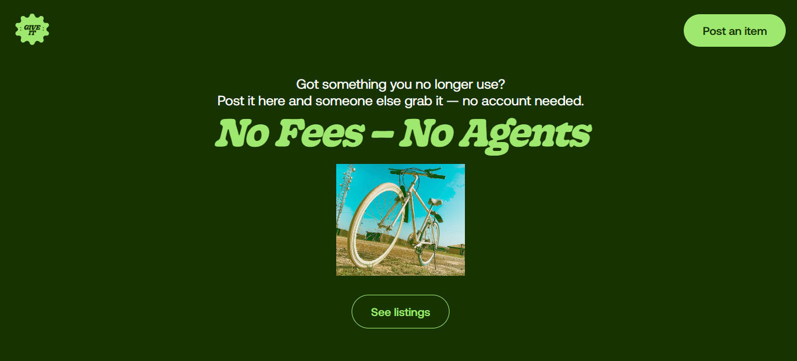

# Howmuchebe Giveaway

A community-powered platform for giving away items you no longer need.

### Built for the [MantaHQ x Nexascale BuildJam Hackathon](https://www.mantahq.com)

- UI/UX Design by me
- Developed with React + Vite
- Clean codebase, reusable components
- Fully responsive
- Includes real-time search filtering
- Includes image validation and provides fallback image
- Shows time posted + archives after 2 weeks

🔗 [Visit GiveIt](https://giveit.netlify.app)



## Features

- Upload item images
- Post item title, description, and location
- Items expire after 2 weeks (auto-archived logic)
- Real-time search bar
- Modal preview of item details
- Loading spinner and user-friendly states
- Font: Aeonik (custom applied)
- Fully responsive layout

## Tech Stack

- React (w/ Vite)
- React Router
- CSS
- Netlify for deployment
- MantaHQ API for backend data

## Folder Structure

```
public/
│ ...
src/
│ ├─ api/
│ ├─ assets/          # Static assets (fonts, etc.)
│ ├─ components/      # Reusable React components
│ ├─ pages/           # Page-level components
│ ├─ App.jsx          # Main app component
│ ├─ main.jsx         # Entry point for React
│ └─ index.css        # Global and component-specific styles
```

## Credits

- UI/UX by [Chimamanda Justus](https://www.linkedin.com/in/trevorcjustus)
- API powered by [MantaHQ](https://www.mantahq.com)

Say hello 👋🏽 on [LinkedIn](https://www.linkedin.com/in/trevorcjustus) or [X](https://www.x.com/trevoppa)!
